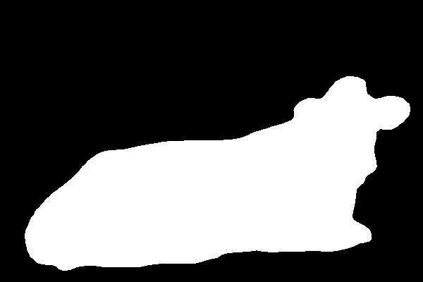

# Binary Image Segmentation with DeepLabv3-ResNet50

## Overview

A compact PyTorch project that fine-tunes a pre-trained DeepLabv3-ResNet50 model (from torchvision) for binary foreground vs background segmentation. The pipeline includes dataset handling (SBD/PASCAL style masks), training utilities (masked loss, auxiliary head support, freezing/unfreezing strategy), and a downstream application that uses the predicted mask to produce a foreground-only PNG (RGBA with transparent background).

## Highlights

- Fine-tune a pre-trained DeepLabv3 model for a single-channel binary segmentation task
- Supports head-only warmup (freeze backbone), then full fine-tuning with differential learning rates
- Inference utilities: save grayscale masks and RGBA foregrounds
- Example scripts to train, validate, and run inference on images
- Model state (in .pth) can be accessed here: [Gdrive](https://drive.google.com/drive/folders/1un3hQg6ev3cqUaQTZ6eKmm73G8s6mi3g?usp=sharing)

## Dataset

For fine-tuning, this project uses torchvision.datasets.SBDataset which uses pixel-level label PNGs in PASCAL/SBD style where:

- 0 = background
- 1..N = object class indices (treat any non-zero as foreground)
- 255 = ignore / void (these pixels are excluded from loss and metrics)

The SBBinaryDataset wrapper provided in utils.py converts class-index masks to a binary mask plus a valid_mask (0/1) that marks which pixels should be used in loss computation.

During Inference, input images can be of varying sizes between dataset.

## Example Output

